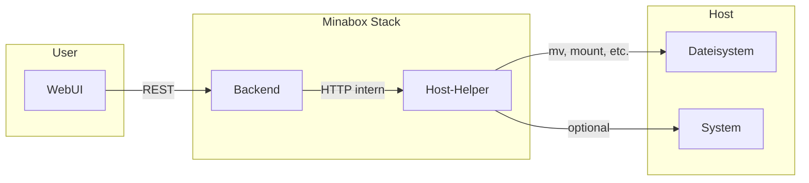

# Host-Helper-Service – Architecture

## 1. Zweck & Verantwortung

Der Host-Helper-Service kapselt systemnahe Aktionen auf dem Host (z.B. Dateien verschieben, später ggf. Mounts, Netz- oder Passwortänderungen). Er wird ausschließlich vom Backend per HTTP aufgerufen und ist nicht von außen erreichbar. Ziel ist, dass Endnutzer keine Linux- oder SSH-Kenntnisse benötigen; alle relevanten Aktionen werden über die WebUI ausgelöst und vom Host-Helper auf dem Host ausgeführt.

Ziele:

- Ausführung von erlaubten, systemnahen Aktionen nach strenger Validierung (z.B. Audio-Ordner verschieben)
- Kein direkter Zugriff der WebUI auf den Host; alle Aufrufe laufen über das Backend
- Einheitliche Stelle für Host-Operationen (Audit, Logging, Sicherheitsregeln)

Nicht-Ziele:

- Kein direkter Zugriff von der WebUI auf den Host-Helper (nur Backend)
- Keine Dienste oder Aktionen, die nicht explizit erlaubt und dokumentiert sind
- Keine generische Shell-Ausführung; nur fest definierte, validierte Operationen

---

## 2. Sicherheitsmodell

- **Container mit erweiterten Rechten:** Der Service läuft mit `privileged: true` oder mit gezielten `cap_add` und notwendigen Volume-Mounts, um auf Host-Pfade zuzugreifen.
- **Nur intern erreichbar:** Die HTTP-API des Host-Helpers wird **nicht** nach außen exponiert (kein `ports:` in docker-compose). Erreichbar nur innerhalb des Docker-Netzes (z.B. `http://host-helper:PORT`).
- **Aufrufer:** Nur das Backend darf den Host-Helper aufrufen. Empfohlen: interner API-Key oder Token, der nur dem Backend bekannt ist und bei jedem Request mitgesendet wird (gleiches Netz reicht als erste Absicherung).
- **Eingabevalidierung:**
  - Erlaubte Pfade: Allowlist bzw. konfigurierbare Basis-Pfade; alle übergebenen Pfade müssen darunter liegen und gegen Path-Traversal abgesichert sein.
  - Keine beliebigen Shell-Befehle; nur fest definierte Aktionen mit parametrisierten Argumenten.
- **Logging:** Alle Aktionen werden protokolliert (Aufrufer, Zeitpunkt, Aktion, Parameter, Ergebnis). Ermöglicht Audit und Fehleranalyse.

---

## 3. Schnittstelle (konzeptionell)

Der Host-Helper stellt eine kleine HTTP-API bereit (z.B. mit FastAPI). Die folgenden Endpoints sind konzeptionell; Implementierungsdetails gehören in die spätere Umsetzung.

### Phase 1 (empfohlener Fokus)

- **`POST /move`** – Dateien oder Ordner verschieben.
  - Request: Quellpfad, Zielpfad (beide innerhalb erlaubter Basis-Pfade).
  - Response: Erfolg/Fehler, ggf. Hinweis (z.B. Ziel existiert bereits).
  - Validierung: Beide Pfade müssen unter der konfigurierten Allowlist liegen; keine relativen Pfade wie `../`.

### Geplant (später, optional)

- Mounts auflisten (z.B. verfügbare Laufwerke/Partitionen)
- Netz-Konfiguration (z.B. IP-Adresse ändern)
- Passwort ändern (z.B. Root-/User-Passwort)

Keine Implementierungsdetails in dieser Architektur; nur Zweck und grober Vertrag (Request/Response-Idee).

---

## 4. Integration mit dem Backend

- Das **Backend** ruft den Host-Helper über eine interne URL auf (z.B. `http://host-helper:8000`), nur aus dem gemeinsamen Docker-Netz.
- Das Backend kann eigene REST-Endpoints bereitstellen (z.B. `POST /api/v1/system/move-audio`), die von der WebUI aufgerufen werden. Nach Validierung der Parameter leitet das Backend die Anfrage an den Host-Helper weiter und gibt das Ergebnis an die WebUI zurück.
- **Abhängigkeiten:** Der Host-Helper kann parallel zum Backend starten oder danach; das Backend muss fehlgeschlagene Aufrufe abfangen (z.B. Host-Helper nicht erreichbar, Timeout). In diesem Fall soll die WebUI eine klare Fehlermeldung erhalten, ohne Host-Details zu exponieren.

---

## 5. Einsatz im Stack

- Der Host-Helper wird im zentralen **`docker-compose.yml`** im Root-Repository als Service (z.B. `host-helper`) eingetragen. Er gehört zum gleichen Docker-Netzwerk wie Backend und erhält die nötigen Volume-Mounts für die erlaubten Host-Pfade.
- Keine Port-Freigabe nach außen; der Service ist nur für andere Container im Stack erreichbar.

---

## 6. Scope und Erweiterbarkeit

- **Phase 1 (empfohlen für erste Implementierung):** Fokus auf **Audio-Ordner verschieben**. Ein klar begrenzter Use-Case: User wählt in der WebUI einen Zielpfad (aus erlaubten Optionen), Backend validiert und ruft Host-Helper auf; Host-Helper führt die Verschiebung aus, Backend kann danach ggf. Konfiguration/DB aktualisieren.
- **Später erweiterbar:** Weitere Aktionen wie IP-Adresse ändern, Root-Passwort setzen, Volumes mounten können als weitere Endpoints ergänzt werden. Jede neue Aktion muss in dieser Architektur und im Sicherheitsmodell beschrieben und mit Allowlists/Validierung versehen werden.
