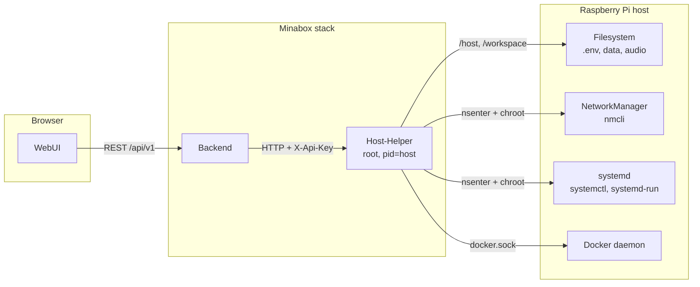

# Host-Helper Service – Architecture

## 1. Purpose & Responsibility

The host-helper service is the only component of the Minabox stack that is
allowed to act on the host itself. Everything a normal user would otherwise
need a terminal and SSH for — reboot, WiFi, static IP, hostname, USB import,
backup, OS update, Bluetooth pairing — is exposed here as a narrow, validated
HTTP endpoint so that the WebUI can offer it as a button.

Goals:

- Execute a fixed set of host operations after strict validation. There is no
  generic "run this command" endpoint; every action is a named route with
  typed parameters.
- Keep host privileges in exactly one container. The backend stays unprivileged
  and only proxies; the WebUI never talks to the host-helper directly.
- Be the single place where host-level auditing and logging happens.

Out of scope: no business logic, no database, no MQTT. The service holds no
state of its own beyond three files under `data/` that track a running update
or OS upgrade. It is a thin, privileged adapter — nothing more.

Because the container runs as root with the host root filesystem mounted
read-write, the shared secret in `X-Api-Key` is the only thing between a
caller and full control of the box. Section 3 describes what that implies.

---

## 2. File & Folder Structure

Relevant path: `services/host-helper-service/`

```text
host-helper-service/
├── Dockerfile              # Two-stage build on python:3.13-slim
├── requirements.txt        # FastAPI, uvicorn, pydantic, structlog, docker SDK
├── VERSION                 # Own version number (docs/Versionierung.md)
├── tests/
│   └── test_update_env.py  # Tag names, .env writing, update-log parsing
└── src/host_helper/
    ├── __init__.py         # Package init
    ├── main.py             # Entry point: config, logging, FastAPI app, uvicorn
    ├── config.py           # load_config() from environment, path allowlist check
    └── api/
        ├── __init__.py
        └── routes.py       # All 48 endpoints plus their helpers
```

`api/routes.py` is a single large module, organised into thematic blocks in
this order: health, audio path, move, host power and restart, WiFi and hotspot,
USB, backup and restore, host status, syslog, timezone, hostname, board LEDs,
network, system password, docker prune, SSH toggle, factory reset, Minabox
update, OS update, Bluetooth, container logs, host diagnostics.

---

## 3. Security Model

### 3.1 Privileges

The container is defined in the root `docker-compose.yml` and runs with:

| Setting                    | Reason                                                  |
| -------------------------- | ------------------------------------------------------- |
| `user: "0:0"`              | `chroot`, `nsenter` and writes to `/etc/shadow` need root |
| `pid: "host"`              | `nsenter -t 1` needs the host's PID 1                    |
| `cap_add: SYS_ADMIN`       | `chroot` into the mounted host root                      |
| `cap_add: SYS_PTRACE`      | entering the host namespaces                             |
| `/:/host:rw`               | the host filesystem, writable                            |
| `.:/workspace:rw`          | the project directory (`.env`, `data/`, service configs) |
| `/var/run/docker.sock`     | the Docker SDK, for container labels and logs           |
| `group_add: ${DOCKER_GID}` | makes the socket readable; host-specific, default 984   |

This is equivalent to root on the host. It is deliberate — the service exists
precisely to do things a container normally cannot — but it means the threat
model is "whoever can reach this port owns the box".

### 3.2 Access control

- **Not published.** The service has no `ports:` entry. It is reachable only
  from inside the `minabox-network` bridge, at `http://host-helper:8000`.
- **Shared secret.** Every route except `GET /health` requires the header
  `X-Api-Key`, checked against `HOST_HELPER_API_KEY`. The comparison uses
  `secrets.compare_digest`, so a wrong key cannot be found by timing.
- **One legitimate caller.** Only the backend holds the key. The WebUI reaches
  these functions through the backend's `/api/v1/system/*` and
  `/api/v1/host/*` routes.

### 3.3 Input validation

- **Paths.** `validate_path_under_allowed()` (audio path) and
  `_validate_host_path_under_allowed()` (move) reject anything containing
  `..`, resolve the path, and require it to sit under one of
  `ALLOWED_BASE_PATHS` (default `/media,/mnt,/home/pi`). When `HOST_ROOT` is
  set, host paths are translated to their container equivalent under `/host`
  before the check.
- **Container names.** `_is_allowed_container_name()` accepts only names that
  start with `minabox-` and contain nothing but letters, digits and hyphens.
- **Update targets.** Service names must appear in the list derived from the
  `VERSION` files on disk; versions must match
  `[0-9A-Za-z][0-9A-Za-z._-]{0,63}`. Both are checked before anything is
  written to `.env` or into the generated update script.
- **Backup archives.** `_backup_allowed_path()` permits only entries under
  `data/` or `services/*/state|config/`. Entries are extracted with
  `zipfile.read()` and `Path.write_bytes()`, so an archive cannot create
  symlinks or escape the workspace.
- **Diagnostics.** `GET /diagnostics/host` takes no parameters at all. The
  three commands it may run are a hard-coded tuple.
- **No shell interpolation of user input.** Subprocesses are invoked with
  argument lists. The two places that use `sh -c` (`/restart`,
  `/system/update-os`) build their command from constants only.

### 3.4 Logging

Structured logging via `structlog` — JSON in normal operation, the console
renderer when `LOG_LEVEL=DEBUG`. Every state-changing action logs an event
(`move_requested`, `hostname_set`, `ssh_toggled`, `update_minabox_started`, …).
Secrets are never logged: the system password is passed to `chpasswd` on stdin,
and the WiFi PSK is not written to any log line.

---

## 4. HTTP API

FastAPI, listening on port 8000. All routes below require `X-Api-Key` unless
noted. Errors use FastAPI's `{"detail": "..."}` shape; the backend passes that
`detail` through to the WebUI.

### Health

| Method | Path      | Description                                                        |
| ------ | --------- | ------------------------------------------------------------------ |
| GET    | `/health` | Liveness. **No API key.** Returns status, service name and version. |

The Docker healthcheck polls this route. It is deliberately `async` and does no
blocking work, so it stays answerable even while a long operation occupies the
sync threadpool. Most routes are plain `def` and therefore run on that
threadpool; only `/backup/restore`, `/bluetooth/scan` and `/container-logs` are
`async` and push their blocking part into a worker thread explicitly.

### Audio path

| Method | Path                 | Description                                                                    |
| ------ | -------------------- | ------------------------------------------------------------------------------ |
| GET    | `/audio-path`        | Reads `AUDIO_FILES_PATH` from the host `.env`. `null` when unset.               |
| POST   | `/apply-audio-path`  | Body `{audio_files_path}`. Validated against the allowlist, written to `.env`. |

The value takes effect on the next `docker compose up`, because it is the bind
mount source for the audio volume.

### Move

| Method | Path           | Description                                                                    |
| ------ | -------------- | ------------------------------------------------------------------------------ |
| POST   | `/move`        | Body `{source, destination}`. Starts a background move, answers `202`.          |
| GET    | `/move-status` | `{status: idle\|running\|done\|error, total, current, error}`.                 |

Both paths are host paths and must lie under the allowlist. A directory move
walks the tree, moves file by file so progress can be reported, and finally
removes the empty directories left behind. A second `POST` while a move is
running is rejected with `409`.

### Host power and services

| Method | Path        | Description                                                             |
| ------ | ----------- | ------------------------------------------------------------------------ |
| POST   | `/reboot`   | `nsenter -t 1 -n -m -- /sbin/reboot`, started detached so the reply wins. |
| POST   | `/shutdown` | Same, with `/sbin/shutdown -h now`.                                      |
| POST   | `/restart`  | `docker compose restart` in the host's project directory, via `nsenter`.  |

`/restart` finds the project directory from the
`com.docker.compose.project.working_dir` label on the backend container rather
than from configuration, so it always matches how the box was actually started.

### Host status and logs

| Method | Path                | Description                                                                       |
| ------ | ------------------- | ----------------------------------------------------------------------------------- |
| GET    | `/host-status`      | hostname, IP, uptime, memory, load, disk, SoC temperature.                            |
| GET    | `/syslog`           | Query `n` (1–20000, default 200) and `source` (`kernel`\|`docker`).                 |
| GET    | `/container-logs`   | Query `container_name` and `tail` (1–500, default 200).                              |
| GET    | `/diagnostics/host` | Failed systemd units, journal errors (priority ≤ 3) and `timedatectl show`.          |

`/host-status` reads the mounted host paths directly (`/host/proc/uptime`,
`/host/proc/meminfo`, `/host/proc/loadavg`, `/host/etc/hostname`, `statvfs` on
`/host`, `/host/sys/class/thermal/thermal_zone0/temp`); any part that cannot be
read comes back as `null` instead of failing the request.

`/syslog` prefers `journalctl` in a chroot into the host and falls back to
reading `/var/log/syslog` or `/var/log/kern.log`. The upper bound of 20000
lines is generous on purpose: the debug export filters container-network noise
out of the kernel log *before* truncating, so it needs a window wide enough to
still contain the last boot.

`/container-logs` uses the Docker SDK over the mounted socket. It exists so the
backend does not need the socket for its admin log view.

`/diagnostics/host` is the debug export's only route into this service. It is
read-only and parameterless by design; see `docs/DebugExport.md` section 4.3.

### WiFi and hotspot

| Method | Path                     | Description                                             |
| ------ | ------------------------ | --------------------------------------------------------- |
| GET    | `/wifi/scan`             | Rescan and list networks, deduplicated by SSID.            |
| POST   | `/wifi/connect`          | Body `{ssid, password}`. Empty password means open network. |
| POST   | `/wifi/hotspot/start`    | Body `{ssid, password}`, both optional.                    |
| POST   | `/wifi/hotspot/stop`     | Brings `wlan0` back to client mode.                        |
| GET    | `/wifi/hotspot/status`   | `{active, ssid}`.                                          |

All of these drive `nmcli` on the host through
`nsenter -t 1 -n -- chroot /host … nmcli`. The network namespace of PID 1 is
required, otherwise `wlan0` is simply not visible from inside the container.

Client profiles are named `Minabox-<sanitised SSID>` and are created with an
explicit `wifi-sec.key-mgmt` (`wpa-psk` or `none`); without it NetworkManager
refuses the connection with "property is missing". The hotspot profile is
always called `Minabox-Setup`; when no password is given, a random one is
generated and returned in the response so the WebUI can display it.

### USB

| Method | Path                      | Description                                                   |
| ------ | ------------------------- | --------------------------------------------------------------- |
| GET    | `/usb/devices`            | Block devices with `TRAN=usb`; partitions rather than raw disks. |
| GET    | `/usb/{device_id}/files`  | Top-level listing; mounts via `udisksctl` if necessary.          |
| POST   | `/usb/import`             | Body `{device_id, source_paths}`; copies to `AUDIO_STORAGE_PATH`. |
| POST   | `/usb/eject`              | `udisksctl unmount` followed by `power-off`.                     |

`device_id` is a bare device name such as `sda1`; anything containing `/` or
`..` is rejected. Entries in `source_paths` are relative to the mount point and
are skipped if they are absolute or contain `..`.

### Backup and restore

| Method | Path                      | Description                                                |
| ------ | ------------------------- | ------------------------------------------------------------ |
| GET    | `/backup/download`        | Returns `minabox-backup-<YYYYMMDD-HHMM>.zip` as an attachment. |
| POST   | `/backup/restore`         | Multipart upload; starts the restore, answers `202`.          |
| GET    | `/backup/restore-status`  | `{status: idle\|running\|done\|error, error, finished_at}`.   |

The archive contains `data/minabox.db`, `data/general_settings.json`,
`data/static/**`, `services/audio-service/state/audio_state.json` and the LED,
button and display config files. The same builder is used for the automatic
pre-update backup, so a snapshot that only ever existed as a download would be
useless when an update goes wrong.

Restore spools the upload to disk rather than into memory and rejects it before
anything is touched if an entry falls outside the path allowlist, if the archive
is not a ZIP, or if it would unpack beyond the size cap — a small archive can
otherwise expand far enough to fill the SD card.

Only then does the work start, in a background thread:

1. `docker compose stop` for every service **except this one**. The writers
   have to be down; overwriting `minabox.db` under an open SQLite connection is
   how a restore turns a working box into a broken one. Stopping the
   host-helper too would kill the process that still has to finish the job.
2. Extract into the workspace.
3. `docker compose up -d` to bring everything back. If a step fails, the stack
   is started again anyway — a half-restored box that is reachable beats one
   that is merely consistent.

The endpoint answers `202` before step 1, and it has to: the restore stops the
backend, and the backend is the caller. A synchronous reply would be cut off on
its way out and a successful restore would look like a failure. The outcome is
polled from `/backup/restore-status`.

### Time and hostname

| Method | Path                    | Description                                            |
| ------ | ----------------------- | -------------------------------------------------------- |
| PUT    | `/system/timezone`      | Body `{timezone}`, e.g. `Europe/Berlin`.                  |
| GET    | `/system/time-status`   | Timezone, NTP sync state, local time.                     |
| GET    | `/system/hostname`      | Current hostname.                                         |
| PUT    | `/system/hostname`      | Body `{hostname}`; 1–63 chars, `a-z0-9-`.                 |

Setting the hostname runs `hostnamectl set-hostname` in the chroot and then
rewrites the `127.0.1.1` line in the host's `/etc/hosts`. Note that the mDNS
name of the box changes with it, so the WebUI URL changes too.

### Board LEDs (stealth mode)

| Method | Path                  | Description                                    |
| ------ | --------------------- | ------------------------------------------------ |
| GET    | `/system/board-leds`  | `{stealth, power_led, activity_led}`.             |
| PUT    | `/system/board-leds`  | Body `{stealth}`; switches both board LEDs off.  |

Writes take effect twice: to `/sys/class/leds/*/brightness` for the immediate
effect, and to `dtparam=act_led_trigger` / `dtparam=pwr_led_trigger` in the
host's `config.txt` so the setting survives a reboot.

### Network (IPv4)

| Method | Path               | Description                                                       |
| ------ | ------------------ | ------------------------------------------------------------------- |
| GET    | `/system/network`  | Method (`dhcp`/`manual`), address, netmask, gateway, DNS.            |
| PUT    | `/system/network`  | Body `{method, address, netmask, gateway, dns}`.                     |

The connection is brought down before it is modified, so the old DHCP lease is
released and the interface does not end up with two addresses. The active
connection is discovered through `nmcli`, excluding the hotspot profile.

### System password and SSH

| Method | Path                   | Description                                            |
| ------ | ---------------------- | -------------------------------------------------------- |
| POST   | `/system/password`     | Body `{username, new_password}`; minimum 8 characters.    |
| GET    | `/system/ssh-status`   | `{enabled, active}` from `systemctl is-enabled/is-active`. |
| POST   | `/system/ssh-toggle`   | Body `{enable}`.                                          |

Only the user named by `DEFAULT_USER` (default `pi`) may be changed. The
password is handed to `chpasswd` on stdin, never on the command line. Disabling
SSH stops and disables `ssh.socket` first, otherwise socket activation would
bring the daemon straight back.

### Maintenance

| Method | Path                     | Description                                                   |
| ------ | ------------------------ | --------------------------------------------------------------- |
| POST   | `/system/docker-prune`   | `docker system prune -f` on the host; keeps tagged images.       |
| POST   | `/system/factory-reset`  | Body `{delete_audio}`. Resets DB and configs, starts the hotspot. |

Factory reset deletes `minabox.db`, resets `general_settings.json` and
`audio_state.json` to `{}`, optionally empties the audio storage directory
(only when it lies under an allowed base path), brings up the `Minabox-Setup`
hotspot so the box stays reachable, and restarts the containers.

### Minabox update

| Method | Path                             | Description                                            |
| ------ | -------------------------------- | -------------------------------------------------------- |
| POST   | `/system/update-minabox`         | Body `{targets, backup}`, both optional. Starts an update. |
| GET    | `/system/update-minabox/status`  | Progress, parsed step, exit code and the full log.        |
| GET    | `/system/version`                | The commit the project directory sits on.                 |

The update does **not** run as a child process of this container. It is
launched as a transient systemd unit (`systemd-run --unit=minabox-update`) on
the host, for two reasons:

1. `docker compose up -d` recreates the host-helper itself as soon as its image
   changes. A child process of this container would be killed halfway through
   the update.
2. There is no Docker CLI inside the container; the host has one.

Progress is written as markers (`=== MINABOX-STEP n/5 <key>`, then
`=== MINABOX-DONE <rc>`) into `data/minabox-update.log`, which lives in the
project directory and therefore survives a restart of the host-helper. The five
steps are `backup`, `repo`, `pull`, `restart`, `verify`; the WebUI translates
these keys, so they are part of the contract and must not be renamed.

With `targets`, exactly the named services are moved to exactly the named
versions and every other service is pinned to its currently running version in
`.env` — without that pinning, `compose up -d` would drag everything else along
and a targeted update would not be one. Without `targets`, everything goes to
the newest published image.

`/system/version` reports the commit only. Whether a newer *image* exists is a
different question — a box can be git-current and still run last week's
containers — and the backend answers it against the registry. The
`update_available` field stays in the response for shape stability and is
always `false`.

The `verify` step does not just check that a container is running but compares
its `org.opencontainers.image.version` label against the requested version. A
container that compose never recreated looks healthy while still running the
old build.

Unless `backup: false` is passed, a pre-update backup is written to
`data/backups/pre-update-<timestamp>.zip` before anything else happens, and the
update is aborted if that fails. The five most recent archives are kept.

### OS update

| Method | Path                     | Description                                                      |
| ------ | ------------------------ | ------------------------------------------------------------------ |
| POST   | `/system/update-os`      | Starts `apt-get update && apt-get upgrade -y` on the host, detached. |
| GET    | `/system/update-os/log`  | `{running, log}`, log truncated to the last 2000 lines.              |

The process is started with `nsenter` and `start_new_session=True`, its PID is
recorded in `data/os-update.pid`, and a watcher thread appends the exit code to
`data/os-update.log` when it finishes.

### Bluetooth

| Method | Path                     | Description                                        |
| ------ | ------------------------ | ---------------------------------------------------- |
| GET    | `/bluetooth/scan`        | 12-second discovery, returns address and name.        |
| POST   | `/bluetooth/pair`        | Body `{address}`; the device is trusted afterwards.   |
| GET    | `/bluetooth/paired`      | Paired devices only, with their connection state.     |
| POST   | `/bluetooth/connect`     | Body `{address}`.                                     |
| POST   | `/bluetooth/disconnect`  | Body `{address}`.                                     |
| POST   | `/bluetooth/remove`      | Body `{address}`; unpairs the device.                 |

`bluetoothctl` runs on the host via `nsenter -t 1 -m -n`, which it needs in
order to open the Bluetooth management socket. The scan keeps one interactive
`bluetoothctl` process alive for the whole 12 seconds: on most setups discovery
stops the moment the client disconnects, so a simple `scan on` with a timeout
would return an empty list. `paired` filters the device list through
`bluetoothctl info <addr>` and keeps only entries reporting `Paired: yes`.

---

## 5. Configuration

Read once at startup by `load_config()`. Missing required values abort the
process with exit code 1 rather than starting in a half-configured state.

| Variable                | Required | Default              | Meaning                                     |
| ----------------------- | -------- | -------------------- | --------------------------------------------- |
| `LOG_LEVEL`             | yes      | –                    | `DEBUG` selects the console renderer.          |
| `HOST_HELPER_API_KEY`   | yes      | –                    | The shared secret; see section 3.2.            |
| `HOST_HELPER_PORT`      | no       | `8000`               | Listening port.                                |
| `ENV_FILE_PATH`         | no       | `/workspace/.env`    | The host `.env` that is read and written.      |
| `ALLOWED_BASE_PATHS`    | no       | `/media,/mnt,/home/pi` | Path allowlist for audio path and move.      |
| `HOST_ROOT`             | no       | *(empty)*            | Mount point of the host root, in practice `/host`. |
| `HOST_PROC`             | no       | `/host/proc`         | Host `/proc` for the status readout.           |
| `HOST_ETC_HOSTNAME`     | no       | `/host/etc/hostname` | Host hostname file.                            |
| `HOST_IP`               | no       | *(empty)*            | Reported verbatim in `/host-status`.           |
| `WORKSPACE_PATH`        | no       | `/workspace`         | Project directory inside the container.        |
| `DATA_PATH`             | no       | `<workspace>/data`   | Database, settings, update logs, backups.      |
| `AUDIO_STORAGE_PATH`    | no       | `<workspace>/audio`  | Target of the USB import.                      |
| `HOST_WORKSPACE_PATH`   | no       | *(derived)*          | Project path **on the host**; read from the compose label when unset. |
| `DEFAULT_USER`          | no       | `pi`                 | The only account `/system/password` may change. |

`HOST_WORKSPACE_PATH` matters because the update script runs on the host and
must therefore use host paths, not `/workspace`. Reading it from the
`com.docker.compose.project.working_dir` label is more reliable than
configuring it: by definition it matches how the box was started.

---

## 6. Integration with the Backend

The backend is the only client. It reaches the service at
`http://host-helper:8000` inside the compose network, adds the `X-Api-Key`
header, and exposes its own validated routes to the WebUI:

- `/api/v1/system/*` — logs, host status, update, maintenance
- `/api/v1/host/*` — power, network, WiFi, USB, Bluetooth, backup

The backend does not merely forward. It validates parameters itself, maps
service names to container names, and translates transport failures into a
stable error shape: `host_helper_not_configured` (no API key),
`host_helper_unreachable` (connection refused or timeout),
`host_helper_auth_failed` (401). The `detail` of any other error is taken from
the host-helper response and passed on unchanged, which is why error strings in
this service are user-visible.

The backend must tolerate the host-helper being absent: it starts after the
backend is healthy, and every proxy call is wrapped so that a missing helper
produces a clear message in the WebUI instead of a stack trace.



---

## 7. Deployment

Defined in the root `docker-compose.yml` as the `host-helper` service. Image
`ghcr.io/opnek90/minabox-host-helper:${MINABOX_HOST_HELPER_TAG}`; the service
carries its own version number (`docs/Versionierung.md`).

- No `ports:` entry — reachable only from within `minabox-network`.
- `depends_on: backend (service_healthy)`, `restart: unless-stopped`.
- Healthcheck: `curl -f http://localhost:8000/health` every 30 s, 10 s grace.
- Mounts and capabilities as listed in section 3.1.

The image is built from `services/host-helper-service/Dockerfile` with
`./services` as the build context, so `shared-lib` can be installed from the
same context. The build is two-stage: dependencies are installed in a builder
stage and the resulting `site-packages` is copied into a fresh
`python:3.13-slim` runtime.

---

## 8. Errors & Logging

- **`401`** missing or wrong `X-Api-Key`.
- **`400`** validation failed — path outside the allowlist, unknown service,
  malformed version, invalid hostname, unknown device.
- **`404`** the source path, container or device does not exist.
- **`409`** an operation of that kind is already running (move, update).
- **`502`** the host tool ran but reported failure; the message is the tail of
  its stderr/stdout, truncated.
- **`503`** the host tool is not available at all (`nmcli`, `hostnamectl`,
  `udisksctl`, `apt-get`, `nsenter` missing) or the update could not be
  prepared.
- **`504`** a host tool exceeded its timeout.

Read-only status routes take the opposite approach: `/host-status`,
`/system/time-status`, `/system/board-leds` and `/diagnostics/host` never fail
on a partial read. Whatever could not be determined is reported as `null` or
as a per-command error object, so a single unreadable file does not blank the
whole maintenance page.

Logging is structured (`structlog`) and goes to stdout, where Docker collects
it. Event names are snake_case and stable enough to grep for
(`move_requested`, `move_ok`, `move_failed`, `apply_audio_path_ok`,
`hostname_set`, `network_set`, `ssh_toggled`, `board_leds_set`,
`password_changed`, `docker_prune_done`, `update_minabox_started`,
`factory_reset_done`).
