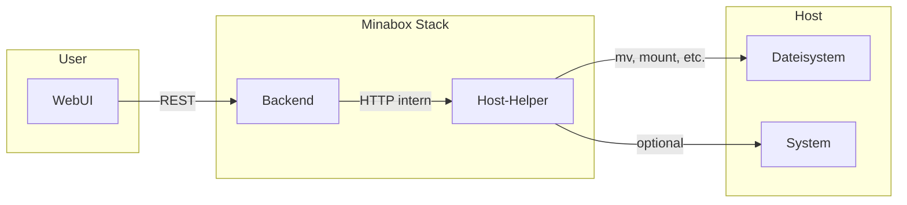

# Host-Helper-Service – Architecture

## 1. Zweck & Verantwortung

Der Host-Helper-Service kapselt systemnahe Aktionen auf dem Host (z.B. Dateien verschieben, später ggf. Mounts, Netz- oder Passwortänderungen). Er wird ausschließlich vom Backend per HTTP aufgerufen und ist nicht von außen erreichbar. Ziel ist, dass Endnutzer keine Linux- oder SSH-Kenntnisse benötigen; alle relevanten Aktionen werden über die WebUI ausgelöst und vom Host-Helper auf dem Host ausgeführt.

Ziele:

- Ausführung von erlaubten, systemnahen Aktionen nach strenger Validierung (z.B. Audio-Ordner verschieben)
- Kein direkter Zugriff der WebUI auf den Host; alle Aufrufe laufen über das Backend
- Einheitliche Stelle für Host-Operationen (Audit, Logging, Sicherheitsregeln)

Nicht-Ziele:

- Kein direkter Zugriff von der WebUI auf den Host-Helper (nur Backend)
- Keine Dienste oder Aktionen, die nicht explizit erlaubt und dokumentiert sind
- Keine generische Shell-Ausführung; nur fest definierte, validierte Operationen

---

## 2. Datei- und Ordnerstruktur

Relevanter Pfad: `services/host-helper-service/src/host_helper/`

```text
host_helper/
├── __init__.py       # Package-Init
├── main.py           # Einstiegspunkt: Config, FastAPI-App mit Router-Mount, Uvicorn, Graceful Shutdown
├── config.py         # Lädt Env (API-Key, erlaubte Pfade, etc.)
├── api/
│   ├── __init__.py
│   └── routes.py     # Alle HTTP-Endpoints in einer Datei: Health, Audio-Pfad, Move, Reboot, Host-Status, Container-Logs, WiFi, USB, Backup, Zeit, Hostname, Board-LEDs, Netzwerk, Passwort, SSH, Syslog, Docker, Factory Reset, Update, Bluetooth
└── core/
    └── __init__.py   # (leer oder Re-Export)
```

**Thematische Blöcke in `api/routes.py`:** Health, Audio-Pfad (GET/POST), Move (POST, GET move-status), Host-System (reboot, shutdown, host-status, restart), Container-Logs, WiFi (scan, connect, hotspot start/stop/status), USB (devices, files, import, eject), Backup (download, restore), Zeit & Hostname (timezone, time-status, hostname GET/PUT), Board-LEDs (GET/PUT), Netzwerk (GET/PUT), Passwort & SSH (password, ssh-status, ssh-toggle), Syslog & Docker (syslog, docker-prune), Factory Reset & Update (factory-reset, update-minabox, version, update-os, update-os/log), Bluetooth (scan, pair, paired, connect, disconnect, remove).

---

## 3. Sicherheitsmodell

- **Container mit erweiterten Rechten:** Der Service läuft mit `privileged: true` oder mit gezielten `cap_add` und notwendigen Volume-Mounts, um auf Host-Pfade zuzugreifen.
- **Nur intern erreichbar:** Die HTTP-API des Host-Helpers wird **nicht** nach außen exponiert (kein `ports:` in docker-compose). Erreichbar nur innerhalb des Docker-Netzes (z.B. `http://host-helper:PORT`).
- **Aufrufer:** Nur das Backend darf den Host-Helper aufrufen. Empfohlen: interner API-Key oder Token, der nur dem Backend bekannt ist und bei jedem Request mitgesendet wird (gleiches Netz reicht als erste Absicherung).
- **Eingabevalidierung:**
  - Erlaubte Pfade: Allowlist bzw. konfigurierbare Basis-Pfade; alle übergebenen Pfade müssen darunter liegen und gegen Path-Traversal abgesichert sein.
  - Container-Logs: Nur erlaubte Container-Namen (Allowlist, z.B. `minabox-*`); keine beliebigen Namen oder Path-Traversal.
  - Keine beliebigen Shell-Befehle; nur fest definierte Aktionen mit parametrisierten Argumenten.
- **Logging:** Alle Aktionen werden protokolliert (Aufrufer, Zeitpunkt, Aktion, Parameter, Ergebnis). Ermöglicht Audit und Fehleranalyse.

---

## 4. Schnittstelle (HTTP-API)

Der Host-Helper stellt eine HTTP-API bereit (FastAPI). Alle Endpoints außer `GET /health` erfordern den Header `X-Api-Key` mit dem konfigurierten API-Key (nur Backend bekannt).

### Health

- **`GET /health`** – Health-Check (ohne API-Key). Für Docker/Orchestrierung.

### Audio-Pfad

- **`GET /audio-path`** – Liest `AUDIO_FILES_PATH` aus der `.env`-Datei. Response: `{ "audio_files_path": "/mnt/audio" }` oder `null`, wenn nicht gesetzt.
- **`POST /apply-audio-path`** – Audio-Pfad setzen. Request-Body: `{ "audio_files_path": "/media/usb0/music" }`. Validierung gegen Allowlist; Wert wird in der Host-`.env` geschrieben (für nächsten Start).

### Verschiebung (Move)

- **`POST /move`** – Dateien oder Ordner verschieben.
  - Request: Quellpfad, Zielpfad (beide innerhalb erlaubter Basis-Pfade).
  - Response: Erfolg/Fehler, ggf. Hinweis (z.B. Ziel existiert bereits).
  - Validierung: Beide Pfade müssen unter der konfigurierten Allowlist liegen; keine relativen Pfade wie `../`.
- **`GET /move-status`** – Status der laufenden oder letzten Verschiebung. Response: z.B. `{ "status": "running" | "idle", ... }` (ggf. Fortschritt, Fehlermeldung).

### Host-System

- **`POST /reboot`** – Host-Neustart (Raspberry Pi Reboot). Response: Bestätigung; Verbindung bricht danach ab.
- **`GET /host-status`** – Host-Infos (Hostname, IP, RAM, CPU, Disk, Load, Temperatur). Liest von gemounteten Host-Pfaden (z.B. `/host/etc`, `/host/proc`). Response: JSON mit hostname, ip, memory, cpu, disk, load, **temperature_celsius** (in °C, gelesen aus `/host/sys/class/thermal/thermal_zone0/temp` bzw. `/sys/class/thermal/thermal_zone0/temp` wenn kein Host-Root-Mount; Wert in Milligrad, umgerechnet in °C; bei Fehler oder fehlender Datei `null`).

### Container-Logs

- **`GET /container-logs`** – Logs eines Docker-Containers abrufen. Query-Parameter: `container_name` (z.B. `minabox-audio`), `tail` (Anzahl Zeilen, Default 200, max 500). Response: `{ "lines": "<stdout/stderr als Text>", "tail": N }`.
  - **Sicherheit:** Nur Container-Namen aus der Allowlist sind erlaubt (Präfix `minabox-`, alphanumerisch und Bindestriche). Path-Traversal und beliebige Namen werden abgelehnt (HTTP 400). API-Key erforderlich.
  - Das Backend ruft diesen Endpoint für die Admin-Log-Anzeige auf (`GET /api/v1/system/logs?service=...`), da der Host-Helper Zugriff auf die Docker-API hat; das Backend muss keinen Docker-Socket mounten.

### WiFi & Hotspot

- **`GET /wifi/scan`** – Verfügbare WLAN-Netzwerke (SSID, Signal). Nutzt Host-Netzwerk-Namespace (nmcli) damit wlan0 sichtbar ist.
- **`POST /wifi/connect`** – Verbindung zu WLAN (Body: `ssid`, `password`).
- **`POST /wifi/hotspot/start`** – Hotspot starten (Body optional: `ssid`, `password`; Default SSID: Minabox-Setup).
- **`POST /wifi/hotspot/stop`** – Hotspot stoppen.
- **`GET /wifi/hotspot/status`** – Ob Hotspot aktiv ist.

### USB

- **`GET /usb/devices`** – USB-Blockgeräte auflisten (lsblk, TRAN=usb): id, device, size, fstype, mountpoint, label.
- **`GET /usb/{device_id}/files`** – Dateien/Ordner auf gemountetem USB-Gerät (device_id z.B. sda1). Bei Bedarf wird per udisksctl gemountet.
- **`POST /usb/import`** – Ausgewählte Pfade von USB nach AUDIO_STORAGE_PATH kopieren (Body: `device_id`, `source_paths`).
- **`POST /usb/eject`** – USB-Gerät unmounten und power-off (udisksctl).

### Backup & Restore

- **`GET /backup/download`** – ZIP erstellen: minabox.db, general_settings.json, static/, audio_state.json, LED/Button/Display-Config. Response: ZIP-Datei (Attachment).
- **`POST /backup/restore`** – ZIP hochladen; Container stoppen, entpacken in Workspace, Container starten. Nur erlaubte Pfade (data/, services/*/state|config).

### Host-System (erweitert)

- **`GET /host-status`** – Host-Infos (hostname, ip, uptime_seconds, memory, cpu, disk, **temperature_celsius**) aus gemounteten Host-Pfaden (/host/proc, /host/etc/hostname, /host/sys/class/thermal/thermal_zone0/temp für CPU-Temperatur).
- **`POST /reboot`** – Host-Neustart (nsenter, /sbin/reboot).
- **`POST /shutdown`** – Host herunterfahren (nsenter, /sbin/shutdown -h now).
- **`POST /restart`** – Minabox-Container neustarten (nsenter, docker compose restart im Projektverzeichnis).

### Zeit & Hostname

- **`PUT /system/timezone`** – Zeitzone setzen (Body: `timezone`, z.B. Europe/Berlin; timedatectl im chroot).
- **`GET /system/time-status`** – Zeitzone, NTP-Sync, lokale Zeit (timedatectl status).
- **`GET /system/hostname`** – Aktueller Hostname (/host/etc/hostname).
- **`PUT /system/hostname`** – Hostname setzen (hostnamectl), /etc/hosts anpassen.

### Board-LEDs (Stealth)

- **`GET /system/board-leds`** – Status Power-/Activity-LED (stealth on/off).
- **`PUT /system/board-leds`** – Stealth-Modus setzen (Body: `stealth`). Schreibt sysfs und config.txt für Persistenz nach Reboot.

### Netzwerk (IP-Konfiguration)

- **`GET /system/network`** – Aktuelle IPv4-Konfiguration (DHCP/manual, address, gateway, dns) der aktiven Verbindung (nmcli).
- **`PUT /system/network`** – IPv4 setzen (Body: `method` dhcp|manual, `address`, `netmask`, `gateway`, `dns`). Nutzt Host-Netzwerk-Namespace.

### Passwort & SSH

- **`POST /system/password`** – System-User-Passwort ändern (chpasswd im chroot; nur konfigurierter User, z.B. pi).
- **`GET /system/ssh-status`** – SSH enabled/active (systemctl is-enabled/is-active ssh).
- **`POST /system/ssh-toggle`** – SSH ein-/ausschalten (Body: `enable`).

### Syslog & Docker

- **`GET /syslog`** – Letzte N Zeilen Host-Syslog (journalctl -k oder -u docker) oder Fallback /var/log/syslog. Query: `n`, `source` (kernel|docker).
- **`POST /system/docker-prune`** – Auf dem Host `docker system prune -f` ausführen (nsenter).

### Factory Reset & Update

- **`POST /system/factory-reset`** – DB löschen, general_settings zurücksetzen, optional Audio-Storage leeren, Hotspot starten, Container neustarten. Body optional: `delete_audio`.
- **`POST /system/update-minabox`** – docker compose pull && up -d im Workspace.
- **`GET /system/version`** – Aktueller Commit (git), ob Update verfügbar (origin/main ahead).
- **`POST /system/update-os`** – apt-get update && upgrade auf dem Host im Hintergrund starten.
- **`GET /system/update-os/log`** – Log und Laufstatus des OS-Updates.

### Bluetooth

- **`GET /bluetooth/scan`** – Bluetooth-Geräte scannen (bluetoothctl auf Host via nsenter; Scan ~12s).
- **`POST /bluetooth/pair`** – Gerät paaren (Body: `address`). Anschließend trust.
- **`GET /bluetooth/paired`** – Nur gepaarte Geräte (address, name, connected).
- **`POST /bluetooth/connect`** – Verbinden (Body: `address`).
- **`POST /bluetooth/disconnect`** – Trennen (Body: `address`).
- **`POST /bluetooth/remove`** – Gerät entfernen (unpair) (Body: `address`).

### Geplant (später, optional)

- Mounts auflisten (z.B. verfügbare Laufwerke/Partitionen) – teilweise durch USB-API abgedeckt

---

## 5. Integration mit dem Backend

- Das **Backend** ruft den Host-Helper über eine interne URL auf (z.B. `http://host-helper:8000`), nur aus dem gemeinsamen Docker-Netz.
- Das Backend kann eigene REST-Endpoints bereitstellen (z.B. `POST /api/v1/system/move-audio`, `GET /api/v1/system/logs`, `GET /api/v1/system/host-status`), die von der WebUI aufgerufen werden. Nach Validierung der Parameter leitet das Backend die Anfrage an den Host-Helper weiter und gibt das Ergebnis an die WebUI zurück.
- **Logs:** Für die Admin-Log-Anzeige ruft das Backend `GET /container-logs` beim Host-Helper auf (mit Service-zu-Container-Name-Mapping). Der Host-Helper hat Zugriff auf die Docker-API; das Backend muss keinen Docker-Socket mounten, wenn Host-Helper konfiguriert ist.
- **Abhängigkeiten:** Der Host-Helper kann parallel zum Backend starten oder danach; das Backend muss fehlgeschlagene Aufrufe abfangen (z.B. Host-Helper nicht erreichbar, Timeout). In diesem Fall soll die WebUI eine klare Fehlermeldung erhalten, ohne Host-Details zu exponieren.



---

## 6. Einsatz im Stack

- Der Host-Helper wird im zentralen **`docker-compose.yml`** im Root-Repository als Service (z.B. `host-helper`) eingetragen. Er gehört zum gleichen Docker-Netzwerk wie Backend und erhält die nötigen Volume-Mounts für die erlaubten Host-Pfade.
- Keine Port-Freigabe nach außen; der Service ist nur für andere Container im Stack erreichbar.

---

## 7. Scope und Erweiterbarkeit

- **Phase 1 (empfohlen für erste Implementierung):** Fokus auf **Audio-Ordner verschieben**. Ein klar begrenzter Use-Case: User wählt in der WebUI einen Zielpfad (aus erlaubten Optionen), Backend validiert und ruft Host-Helper auf; Host-Helper führt die Verschiebung aus, Backend kann danach ggf. Konfiguration/DB aktualisieren.
- **Später erweiterbar:** Weitere Aktionen wie IP-Adresse ändern, Root-Passwort setzen, Volumes mounten können als weitere Endpoints ergänzt werden. Jede neue Aktion muss in dieser Architektur und im Sicherheitsmodell beschrieben und mit Allowlists/Validierung versehen werden.

---

## 8. Refactoring-Checkliste

- [ ] **api/routes.py aufteilen:** Die Datei enthält sehr viele Endpoints (Audio-Pfad, Move, Reboot, WiFi, USB, Backup, System, Bluetooth, Zeit, Hostname, etc.). Empfehlung: Aufteilung nach Domänen in mehrere Route-Module (z. B. `routes_system.py`, `routes_wifi.py`, `routes_usb.py`, `routes_backup.py`, `routes_bluetooth.py`) und in der FastAPI-App zusammenführen.
- [ ] Nach Refactoring: Dateistruktur und „Funktion pro Datei“ in diesem Dokument aktualisieren.
