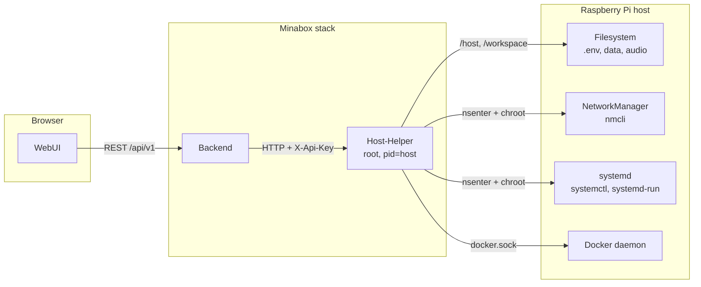

# Host-Helper Service

The only component of the Minabox stack allowed to act on the host itself.
Everything a user would otherwise need a terminal and SSH for — reboot, WiFi,
static IP, hostname, USB import, backup, OS update, Bluetooth pairing — is
exposed here as a narrow, validated HTTP endpoint so the WebUI can offer it as
a button.

| | |
| --- | --- |
| Image | `ghcr.io/opnek90/minabox-host-helper` |
| Source | `services/host-helper-service/src/host_helper/` |
| Version | `services/host-helper-service/VERSION` |
| Compose service | `host-helper` (no profile — always on) |
| Runtime | Python 3.13, FastAPI/uvicorn, Docker SDK. Root, `pid: host`, host root mounted read-write |
| Speaks | HTTP on port `8000`, **not published** — compose network only |
| Needs | the host: `nsenter`, `chroot`, `nmcli`, `systemctl`, `udisksctl`, `bluetoothctl`, `apt-get`, the Docker socket |

## 1. Purpose & Responsibility

- Execute a **fixed set** of host operations after strict validation. There is
  no generic "run this command" endpoint; every action is a named route with
  typed parameters.
- Keep host privileges in exactly one container. The backend stays
  unprivileged and only proxies; the WebUI never talks to this service.
- Be the single place where host-level auditing and logging happens.

It deliberately does **not**:

| Not this service | Owned by |
| --- | --- |
| Any business logic | backend |
| A database | backend |
| MQTT of any kind | — deliberately absent |
| Deciding *whether* an action is allowed for a user | backend (authentication and its own validation) |
| Talking to the WebUI | backend — this service has one legitimate caller |

It holds no state of its own beyond three files under `data/` that track a
running update or OS upgrade. It is a thin, privileged adapter — nothing more.

Because the container runs as root with the host root filesystem mounted
read-write, the shared secret in `X-Api-Key` is the only thing between a caller
and full control of the box. Section 4.1 describes what that implies.

## 2. File & Folder Structure

```
services/host-helper-service/
├── Dockerfile                    two-stage build on python:3.13-slim
├── requirements.txt              FastAPI, uvicorn, pydantic, structlog, docker SDK
├── VERSION                       service version, single source
├── src/host_helper/
│   ├── main.py                   entry point: config, logging, FastAPI app, uvicorn
│   ├── config.py                 frozen Config dataclass, load_config(), path allowlist
│   ├── network_ops.py            ** the nmcli plumbing ** — shared by the route
│   │                             module and the watchdog
│   ├── netwatch.py               the connectivity watchdog (see 3.2)
│   └── api/routes/
│       ├── __init__.py           assembles the router from the modules below
│       ├── deps.py               ** the only module the others import from **:
│       │                         Config, the API key check, host root and host
│       │                         tool lookups, nsenter, compose, Docker client
│       ├── health.py             liveness — the one route without a key
│       ├── media.py              audio path, move
│       ├── audio.py              sound repair (steps 1 and 7), audio restart
│       ├── power.py              reboot, shutdown, restart
│       ├── network.py            WiFi, hotspot, IPv4
│       ├── usb.py                devices, browse, import, eject
│       ├── backup.py             download, restore
│       ├── system.py             host status, syslog, clock, hostname, LEDs
│       ├── maintenance.py        password, SSH, prune, factory reset
│       ├── update.py             Minabox update, version, OS update
│       ├── bluetooth.py          scan, pair, connect
│       └── diagnostics.py        container logs, host diagnostics
└── tests/                        see section 8
```

`deps.py` imports nothing from its siblings, so there are no cycles. Two links
cross between domains and are the exceptions: `maintenance` uses the hotspot
from `network` for the factory reset, and `update` uses the archive builder
from `backup` for the pre-update snapshot.

## 3. Runtime Flow

The service is mostly request/response, with three things that outlive a
request.

### 3.1 Sync routes, async health

`GET /health` is deliberately `async` and does no blocking work, so it stays
answerable even while a long operation occupies the sync threadpool. Most
routes are plain `def` and therefore run on that threadpool; only
`/backup/restore`, `/bluetooth/scan` and `/container-logs` are `async` and push
their blocking part into a worker thread explicitly.

### 3.2 netwatch: the connectivity watchdog

`netwatch.py` runs a background task started from the FastAPI lifespan. It
solves a chicken-and-egg problem: every other way of starting the hotspot
assumes you can already reach the box. Every ~20 s it probes NetworkManager and
decides:

- connectivity is present (or a cable is carrying `eth0`) → make sure the
  hotspot is down, reset the offline timer;
- no connectivity, no hotspot, offline for more than 90 s, no ethernet link →
  bring `Minabox-Setup` up so the box is reachable at `http://10.42.0.1`;
- no connectivity but the hotspot is already up → every ~3 min try the saved
  client profiles again; a successful one keeps the hotspot down.

After any switch between AP and client mode nothing else happens for 60 s
(anti-flap). The recovery attempt costs one short AP outage every few minutes
while the box is genuinely offline. There is no on/off switch yet — the only
things that suppress the hotspot are a working connection or a cable. Tunable
through `NETWATCH_ENABLED`, `NETWATCH_GRACE_SECONDS`, `NETWATCH_CHECK_INTERVAL`,
`NETWATCH_RECOVERY_INTERVAL` and `NETWATCH_HOTSPOT_SSID`.

`/network/status` is served from the watchdog's last probe while it runs, so a
polled endpoint costs no `nmcli` calls.

### 3.3 Long jobs answer 202 and are polled

Three operations are too long for a request and are started in the background,
each with its own status route: `/move`, `/backup/restore` and the Minabox
update. A second start of the same kind while one runs is refused with `409`.

For **restore** the `202` is not an optimisation but a requirement: the restore
stops the backend, and the backend is the caller. A synchronous reply would be
cut off on its way out and a successful restore would look like a failure.

For the **update** the work does not even run as a child process of this
container. It is launched as a transient systemd unit
(`systemd-run --unit=minabox-update`) on the host, for two reasons:
`docker compose up -d` recreates the host-helper itself as soon as its image
changes and would kill a child process halfway through; and there is no Docker
CLI inside the container, while the host has one.

Progress is written as markers (`=== MINABOX-STEP n/5 <key>`, then
`=== MINABOX-DONE <rc>`) into `data/minabox-update.log`, which lives in the
project directory and therefore survives a restart of the host-helper.

## 4. Public Interfaces

FastAPI on port 8000, 48 routes. All require `X-Api-Key` unless noted. Errors
use FastAPI's `{"detail": "..."}` shape; the backend passes that `detail`
through to the WebUI, which is why error strings in this service are
user-visible.

### 4.1 Security model

**Privileges.** The container is defined in the root `docker-compose.yml` and
runs with:

| Setting | Reason |
| --- | --- |
| `user: "0:0"` | `chroot`, `nsenter` and writes to `/etc/shadow` need root |
| `pid: "host"` | `nsenter -t 1` needs the host's PID 1 |
| `cap_add: SYS_ADMIN` | `chroot` into the mounted host root |
| `cap_add: SYS_PTRACE` | entering the host namespaces |
| `/:/host:rw` | the host filesystem, writable |
| `.:/workspace:rw` | the project directory (`.env`, `data/`, service configs) |
| `/var/run/docker.sock` | the Docker SDK, for container labels and logs |
| `group_add: ${DOCKER_GID}` | makes the socket readable; host-specific, default 984 |

This is equivalent to root on the host. It is deliberate — the service exists
precisely to do things a container normally cannot — but it means the threat
model is **"whoever can reach this port owns the box"**.

**Access control.**

- **Not published.** The service has no `ports:` entry. It is reachable only
  from inside the `minabox-network` bridge, at `http://host-helper:8000`.
- **No interactive docs.** `/docs`, `/redoc` and `/openapi.json` are disabled
  unless `LOG_LEVEL=DEBUG`. They are the only routes that never asked for the
  API key, and on a service with these privileges publishing the full route and
  parameter list to the compose network is a gift nobody needs to give.
- **Shared secret.** Every route except `GET /health` requires `X-Api-Key`,
  checked against `HOST_HELPER_API_KEY` with `secrets.compare_digest`, so a
  wrong key cannot be found by timing.
- **One legitimate caller.** Only the backend holds the key.

**Input validation.**

- **Paths.** `validate_path_under_allowed()` (audio path) and
  `_validate_host_path_under_allowed()` (move) reject anything containing `..`,
  resolve the path, and require it to sit under one of `ALLOWED_BASE_PATHS`
  (default `/media,/mnt,/home/pi`). When `HOST_ROOT` is set, host paths are
  translated to their container equivalent under `/host` before the check.
- **Container names.** `_is_allowed_container_name()` accepts only names that
  start with `minabox-` and contain nothing but letters, digits and hyphens.
- **Update targets.** Service names must appear in the list derived from the
  `VERSION` files on disk; versions must match `[0-9A-Za-z][0-9A-Za-z._-]{0,63}`.
  Both are checked before anything is written to `.env` or into the generated
  update script.
- **Backup archives.** `_backup_allowed_path()` mirrors what the backup builder
  produces: `data/minabox.db` and `data/general_settings.json` by name,
  `data/static/**` by prefix, and `services/<name>-service/state|config/` per
  service. The rest of `data/` is refused — the update log, the OS-update PID
  file, the pre-update archives and `minabox-update.sh`, which the host runs as
  root, all live there and are this service's own runtime state, not something
  an upload gets to write. Entries are extracted with `zipfile.read()` and
  `Path.write_bytes()`, so an archive cannot create symlinks or escape the
  workspace.
- **USB imports.** Requested entries are rejected if they are absolute or
  contain `..`, and the resolved path must still sit under the mount point.
  Symlinks are skipped rather than followed, both for a directly requested entry
  and for anything inside a copied directory: the stick is mounted under
  `/host`, so a link to `../../../etc/shadow` on a prepared device would
  otherwise resolve to the host's file and copy its content into the audio
  directory.
- **Device names.** `_validate_device_id()` accepts an alphanumeric block device
  name and nothing else. The value ends up in `/dev/<id>`, and the device must
  additionally appear in the `lsblk` listing.
- **Diagnostics.** `GET /diagnostics/host` takes no parameters at all. The three
  commands it may run are a hard-coded tuple.
- **No shell interpolation of user input.** Subprocesses are invoked with
  argument lists. The two places that use `sh -c` (`/restart`,
  `/system/update-os`) build their command from constants only.

**Known residual risk.** The WiFi PSK and the hotspot password are handed to
`nmcli` as command-line arguments, so they are visible in the host's process
list for the fraction of a second the call takes. Avoiding it means writing
NetworkManager keyfiles directly instead of driving `nmcli`, which trades a
narrow exposure on a single-user appliance for a rewrite of the part of this
service that is hardest to get right. It is recorded here as accepted, not
overlooked.

**Secrets are never logged.** The system password is passed to `chpasswd` on
stdin, and the WiFi PSK is not written to any log line.

### 4.2 Health

| Method | Path | Description |
| --- | --- | --- |
| GET | `/health` | liveness. **No API key.** Returns status, service name and version |

### 4.3 Audio path and move

| Method | Path | Description |
| --- | --- | --- |
| GET | `/audio-path` | reads `AUDIO_FILES_PATH` from the host `.env`; `null` when unset |
| POST | `/apply-audio-path` | body `{audio_files_path}`, validated against the allowlist, written to `.env` |
| POST | `/move` | body `{source, destination}`; starts a background move, answers `202` |
| GET | `/move-status` | `{status: idle\|running\|done\|error, total, current, error}` |

The audio path takes effect on the next `docker compose up`, because it is the
bind mount source for the audio volume.

Both move paths are host paths and must lie under the allowlist. A directory
move walks the tree, moves file by file so progress can be reported, and
finally removes the empty directories left behind. The walk itself is part of
the background job, not of the request: on a large library counting the files
takes long enough to be worth reporting on. Until the count is in, the status
reads `total: 0`, which the WebUI shows as an indeterminate bar. A move that
fails partway leaves what it already moved where it moved it — undoing it could
fail halfway too — and `current` says how far it got.

### 4.4 Host power and services

| Method | Path | Description |
| --- | --- | --- |
| POST | `/reboot` | `nsenter -t 1 -n -m -- /sbin/reboot`, started detached so the reply wins |
| POST | `/shutdown` | same, with `/sbin/shutdown -h now` |
| POST | `/restart` | `docker compose restart` in the host's project directory, via `nsenter` |

`/restart` finds the project directory from the
`com.docker.compose.project.working_dir` label on the backend container rather
than from configuration, so it always matches how the box was actually started.

### 4.5 Host status, logs and sound repair

| Method | Path | Description |
| --- | --- | --- |
| GET | `/host-status` | hostname, IP, uptime, memory, load, disk, SoC temperature |
| GET | `/syslog` | query `n` (1–20000, default 200) and `source` (`kernel`\|`docker`) |
| GET | `/container-logs` | query `container_name` and `tail` (1–500, default 200) |
| GET | `/diagnostics/host` | failed systemd units, journal errors (priority ≤ 3), `timedatectl show` |
| POST | `/audio/repair` | steps 1 and 7 of the sound-repair chain |
| POST | `/audio/restart` | `docker compose restart audio` — only that one container |

`/host-status` reads the mounted host paths directly (`/host/proc/uptime`,
`/host/proc/meminfo`, `/host/proc/loadavg`, `/host/etc/hostname`, `statvfs` on
`/host`, `/host/sys/class/thermal/thermal_zone0/temp`); any part that cannot be
read comes back as `null` instead of failing the request.

`/syslog` prefers `journalctl` in a chroot into the host and falls back to
reading `/var/log/syslog` or `/var/log/kern.log`. The upper bound of 20000
lines is generous on purpose: the debug export filters container-network noise
out of the kernel log *before* truncating, so it needs a window wide enough to
still contain the last boot.

`/container-logs` uses the Docker SDK over the mounted socket. It exists so the
backend does not need the socket for its admin log view.

`/diagnostics/host` is the debug export's only route into this service. It is
read-only and parameterless by design; see `docs/DebugExport.md` section 4.3.

`/audio/repair` is the host's half of the chain behind the WebUI's "Fix sound
problem" button. The audio service walks the rest itself — it talks to
PulseAudio over the mounted socket anyway — but `/proc/asound/cards` and
`amixer` need the host. It is parameterless for the same reason
`/diagnostics/host` is: nothing the caller sends decides what runs. The card
numbers and control names that end up in an `amixer` call are read off the host
a moment earlier and checked against a strict pattern before they are used
again.

Step 1 has no automatic repair, on purpose. When the codec fails to probe at
boot — which is how a real box lost its sound card — the driver does not try
again and only a restart brings it back. Saying so is better than a button that
pretends to have done something. Step 7 raises a mixer control only when it
reads as off or at most 5 %, and only to 80 %: the point is to make the box
audible, not loud.

`/audio/restart` restarts only the audio container. Deliberately not
`/restart`, which takes the whole stack down including the WebUI — and the
person waiting for an answer is looking at exactly that page.

### 4.6 WiFi and hotspot

| Method | Path | Description |
| --- | --- | --- |
| GET | `/wifi/scan` | rescan and list networks, deduplicated by SSID |
| POST | `/wifi/connect` | body `{ssid, password}`; empty password means open network |
| POST | `/wifi/hotspot/start` | body `{ssid, password}`, both optional; reuses the profile |
| POST | `/wifi/hotspot/stop` | brings `wlan0` back to client mode |
| GET | `/wifi/hotspot/status` | `{active, ssid}` |
| GET | `/network/status` | full state for the WebUI and the display |

The low-level plumbing lives in `network_ops.py`; the route module and the
watchdog call the same functions. Everything drives `nmcli` on the host through
`nsenter -t 1 -n -- chroot /host … nmcli`. The network namespace of PID 1 is
required, otherwise `wlan0` is simply not visible from inside the container.

Client profiles are named `Minabox-<sanitised SSID>` and are created with an
explicit `wifi-sec.key-mgmt` (`wpa-psk` or `none`); without it NetworkManager
refuses the connection with "property is missing". The hotspot profile is
always `Minabox-Setup`; when no password is given a random one is generated.
`hotspot_up()` reuses an existing profile rather than rebuilding it, so the
password shown on the display and in the WebUI keeps working — only an explicit
password in the request body forces a rebuild.

`/network/status` returns a stable shape: `mode`
(`online` | `local_only` | `hotspot` | `no_network` | `unknown`), `internet`,
`interface`, `interface_type`, `ipv4`, `ssid`, `hotspot`
(`{active, ssid, password}` — the password only while the hotspot is up),
`manage_url`, `fallback_enabled`, and `stale`.

### 4.7 USB

| Method | Path | Description |
| --- | --- | --- |
| GET | `/usb/devices` | block devices with `TRAN=usb`; partitions rather than raw disks |
| GET | `/usb/{device_id}/files` | top-level listing; mounts via `udisksctl` if necessary |
| POST | `/usb/import` | body `{device_id, source_paths}`; copies to `AUDIO_STORAGE_PATH` |
| POST | `/usb/eject` | `udisksctl unmount` followed by `power-off` |

`device_id` is a bare device name such as `sda1`; anything else is rejected.
Entries in `source_paths` are relative to the mount point, and one that
resolves outside it — or is a symlink — is skipped rather than copied. The
response reports both `files_copied` and `skipped`.

### 4.8 Backup and restore

| Method | Path | Description |
| --- | --- | --- |
| GET | `/backup/download` | returns `minabox-backup-<YYYYMMDD-HHMM>.zip` as an attachment |
| POST | `/backup/restore` | multipart upload; starts the restore, answers `202` |
| GET | `/backup/restore-status` | `{status: idle\|running\|done\|error, error, finished_at}` |

The archive contains `data/minabox.db`, `data/general_settings.json`,
`data/static/**`, `services/audio-service/state/audio_state.json` and the LED,
button and display config files. The same builder is used for the automatic
pre-update backup, so a snapshot that only ever existed as a download would be
useless when an update goes wrong. Members are streamed into the archive and
the archive is written to a file, never assembled in memory — the cover art
under `data/static/` is what grows here.

Restore spools the upload to disk rather than into memory and rejects it before
anything is touched if an entry falls outside the path allowlist, if the archive
is not a ZIP, or if it would unpack beyond the size cap — a small archive can
otherwise expand far enough to fill the SD card. Only then does the work start,
in a background thread:

1. `docker compose stop` for every service **except this one**. The writers have
   to be down; overwriting `minabox.db` under an open SQLite connection is how a
   restore turns a working box into a broken one. Stopping the host-helper too
   would kill the process that still has to finish the job.
2. Extract into the workspace.
3. `docker compose up -d` to bring everything back. If a step fails, the stack
   is started again anyway — a half-restored box that is reachable beats one
   that is merely consistent.

### 4.9 Time, hostname, board LEDs, IPv4

| Method | Path | Description |
| --- | --- | --- |
| PUT | `/system/timezone` | body `{timezone}`, e.g. `Europe/Berlin` |
| GET | `/system/time-status` | timezone, NTP sync state, local time |
| GET/PUT | `/system/hostname` | body `{hostname}`; 1–63 chars, `a-z0-9-` |
| GET/PUT | `/system/board-leds` | `{stealth, power_led, activity_led}` / body `{stealth}` |
| GET/PUT | `/system/network` | method (`dhcp`/`manual`), address, netmask, gateway, DNS |

Setting the hostname runs `hostnamectl set-hostname` in the chroot and then
rewrites the `127.0.1.1` line in the host's `/etc/hosts`. The mDNS name of the
box changes with it, so the WebUI URL changes too.

Board LED writes take effect twice: to `/sys/class/leds/*/brightness` for the
immediate effect, and to `dtparam=act_led_trigger` / `dtparam=pwr_led_trigger`
in the host's `config.txt` so the setting survives a reboot.

For IPv4 the connection is brought down before it is modified, so the old DHCP
lease is released and the interface does not end up with two addresses. The
active connection is discovered through `nmcli`, excluding the hotspot profile.

### 4.10 Password, SSH, maintenance

| Method | Path | Description |
| --- | --- | --- |
| POST | `/system/password` | body `{username, new_password}`; minimum 8 characters |
| GET | `/system/ssh-status` | `{enabled, active}` from `systemctl is-enabled/is-active` |
| POST | `/system/ssh-toggle` | body `{enable}` |
| POST | `/system/docker-prune` | `docker system prune -f` on the host; keeps tagged images |
| POST | `/system/factory-reset` | body `{delete_audio}`; resets DB and configs, starts the hotspot |

Only the user named by `DEFAULT_USER` (default `pi`) may be changed. Disabling
SSH stops and disables `ssh.socket` first, otherwise socket activation would
bring the daemon straight back.

Factory reset deletes `minabox.db`, resets `general_settings.json` and
`audio_state.json` to `{}`, optionally empties the audio storage directory
(only when it lies under an allowed base path), brings up the `Minabox-Setup`
hotspot so the box stays reachable, and restarts the containers.

### 4.11 Minabox update and OS update

| Method | Path | Description |
| --- | --- | --- |
| POST | `/system/update-minabox` | body `{targets, backup}`, both optional; starts an update |
| GET | `/system/update-minabox/status` | progress, parsed step, exit code and the full log |
| GET | `/system/version` | the commit the project directory sits on |
| POST | `/system/update-os` | starts `apt-get update && apt-get upgrade -y` detached; `409` while one runs |
| GET | `/system/update-os/log` | `{running, log}`, log truncated to the last 2000 lines |

The five update steps are `backup`, `repo`, `pull`, `restart`, `verify`. **The
WebUI translates these keys, so they are part of the contract and must not be
renamed.**

With `targets`, exactly the named services are moved to exactly the named
versions and every other service is pinned to its currently running version in
`.env` — without that pinning, `compose up -d` would drag everything else along
and a targeted update would not be one. Without `targets`, everything goes to
the newest published image.

`/system/version` reports the commit only. Whether a newer *image* exists is a
different question — a box can be git-current and still run last week's
containers — and the backend answers it against the registry. The
`update_available` field stays in the response for shape stability and is
always `false`.

The `verify` step does not just check that a container is running but compares
its `org.opencontainers.image.version` label against the requested version. A
container that compose never recreated looks healthy while still running the old
build.

Unless `backup: false` is passed, a pre-update backup is written to
`data/backups/pre-update-<timestamp>.zip` before anything else happens, and the
update is aborted if that fails. The five most recent archives are kept.

The OS update is started with `nsenter` and `start_new_session=True`, its PID is
recorded in `data/os-update.pid`, and a watcher thread appends the exit code to
`data/os-update.log` when it finishes. The container shares the host PID
namespace, so that recorded PID can be checked with signal 0 — which is how both
the log route reports `running` and the start route refuses a second run that
would only fight the first over the dpkg lock.

### 4.12 Bluetooth

| Method | Path | Description |
| --- | --- | --- |
| GET | `/bluetooth/scan` | 12-second discovery, returns address and name |
| POST | `/bluetooth/pair` | body `{address}`; the device is trusted afterwards |
| GET | `/bluetooth/paired` | paired devices only, with their connection state |
| POST | `/bluetooth/connect` / `/disconnect` / `/remove` | body `{address}` |

`bluetoothctl` runs on the host via `nsenter -t 1 -m -n`, which it needs in
order to open the Bluetooth management socket. The scan keeps one interactive
`bluetoothctl` process alive for the whole 12 seconds: on most setups discovery
stops the moment the client disconnects, so a simple `scan on` with a timeout
would return an empty list. `paired` asks BlueZ to filter, with `devices Paired`
and `devices Connected` — two calls no matter how many devices the box
remembers, rather than one `bluetoothctl info` per entry.

## 5. Configuration

Read once at startup by `load_config()` into a frozen `Config` dataclass.
Missing required values abort the process with exit code 1 rather than starting
in a half-configured state. There is no config file.

| Variable | Required | Default | Meaning |
| --- | --- | --- | --- |
| `LOG_LEVEL` | yes | – | `DEBUG` selects the console renderer **and enables `/docs`** |
| `HOST_HELPER_API_KEY` | yes | – | the shared secret; see 4.1 |
| `HOST_HELPER_PORT` | no | `8000` | listening port |
| `ENV_FILE_PATH` | no | `/workspace/.env` | the host `.env` that is read and written |
| `ALLOWED_BASE_PATHS` | no | `/media,/mnt,/home/pi` | path allowlist for audio path and move |
| `HOST_ROOT` | no | *(empty)* | mount point of the host root, in practice `/host` |
| `HOST_PROC` | no | `/host/proc` | host `/proc` for the status readout |
| `HOST_ETC_HOSTNAME` | no | `/host/etc/hostname` | host hostname file |
| `HOST_IP` | no | *(empty)* | reported verbatim in `/host-status` |
| `WORKSPACE_PATH` | no | `/workspace` | project directory inside the container |
| `DATA_PATH` | no | `<workspace>/data` | database, settings, update logs, backups |
| `AUDIO_STORAGE_PATH` | no | `<workspace>/audio` | target of the USB import |
| `HOST_WORKSPACE_PATH` | no | *(derived)* | project path **on the host**; read from the compose label when unset |
| `DEFAULT_USER` | no | `pi` | the only account `/system/password` may change |
| `NETWATCH_*` | no | see 3.2 | the watchdog's switches and intervals |

`HOST_WORKSPACE_PATH` matters because the update script runs on the host and
must therefore use host paths, not `/workspace`. Reading it from the
`com.docker.compose.project.working_dir` label is more reliable than
configuring it: by definition it matches how the box was started.

## 6. Dependencies

**The host.** `nsenter`, `chroot`, and the tools it drives: `nmcli`,
`hostnamectl`, `timedatectl`, `systemctl`, `udisksctl`, `lsblk`,
`bluetoothctl`, `amixer`, `apt-get`, `journalctl`, and the host's Docker CLI. A
missing tool is a `503`, not a crash.

**The Docker socket**, for container labels and logs through the Docker SDK.

**Privileges and mounts** as listed in 4.1 — those are not incidental, they are
what the service is.

**The backend** is the only client. It reaches
`http://host-helper:8000` inside the compose network, adds `X-Api-Key`, and
exposes its own validated routes to the WebUI:

- `/api/v1/system/*` — logs, host status, update, maintenance
- `/api/v1/host/*` — power, network, WiFi, USB, Bluetooth, backup

The backend does not merely forward. It validates parameters itself, maps
service names to container names, and translates transport failures into a
stable error shape: `host_helper_not_configured` (no API key),
`host_helper_unreachable` (connection refused or timeout),
`host_helper_auth_failed` (401). Any other error's `detail` is taken from the
host-helper response unchanged.

**The backend must tolerate this service being absent**: it starts after the
backend is healthy, and every proxy call is wrapped so a missing helper
produces a clear message in the WebUI instead of a stack trace.



### 6.1 Compose

- No `ports:` entry — reachable only from within `minabox-network`.
- `depends_on: backend (service_healthy)`, `restart: unless-stopped`.
- Health check `curl -f http://localhost:8000/health` every 30 s, 10 s grace.
- Mounts and capabilities as in 4.1.

The image is built from `services/host-helper-service/Dockerfile` with
`./services` as the build context, so `shared-lib` can be installed from the
same context. Two-stage: dependencies in a builder stage, the resulting
`site-packages` copied into a fresh `python:3.13-slim` runtime.

## 7. Errors, Health & Logging

| Status | Meaning |
| --- | --- |
| `401` | missing or wrong `X-Api-Key` |
| `400` | validation failed — path outside the allowlist, unknown service, malformed version, invalid hostname, unknown device |
| `404` | the source path, container or device does not exist |
| `409` | an operation of that kind is already running (move, restore, update) |
| `502` | the host tool ran but reported failure; the message is the tail of its stderr/stdout, truncated |
| `503` | the host tool is not available at all (`nmcli`, `hostnamectl`, `udisksctl`, `apt-get`, `nsenter` missing) or the update could not be prepared |
| `504` | a host tool exceeded its timeout |

Read-only status routes take the opposite approach: `/host-status`,
`/system/time-status`, `/system/board-leds` and `/diagnostics/host` never fail
on a partial read. Whatever could not be determined is reported as `null` or as
a per-command error object, so a single unreadable file does not blank the whole
maintenance page.

Logging is structured (`structlog`) to stdout — JSON in normal operation, the
console renderer at `LOG_LEVEL=DEBUG`. Every state-changing action logs an
event, snake_case and stable enough to grep for: `move_requested`, `move_ok`,
`move_failed`, `apply_audio_path_ok`, `hostname_set`, `network_set`,
`ssh_toggled`, `board_leds_set`, `password_changed`, `docker_prune_done`,
`update_minabox_started`, `factory_reset_done`.

## 8. Development & Tests

This service cannot run meaningfully off the box: almost every route needs
`nsenter`, a host root or the Docker socket. The tests therefore cover the
parts that are pure logic, and those are the parts where a mistake is
dangerous.

```bash
PYTHONPATH=$(ls -d services/*/src | tr '\n' ':') .venv/bin/python -m pytest services/host-helper-service/tests -q
```

| File | Covers |
| --- | --- |
| `test_update_env.py` | the allowlists, `.env` rewriting, and update-log parsing — the validation described in 4.1 |
| `test_network_ops.py` | `nmcli` command building and output parsing |
| `test_netwatch.py` | the watchdog's decisions, the grace period and the anti-flap |
| `test_audio_repair.py` | the repair steps, including "only what is demonstrably wrong" |

```bash
.venv/bin/ruff check services/host-helper-service
```

```bash
./scripts/build-local.sh host-helper
```

## 9. Extending the Service

### Common changes

| I want to … | Start in | Also touch |
| --- | --- | --- |
| add a host action | the matching module under `api/routes/` (or a new one, registered in `routes/__init__.py`) | a validated Pydantic body, a backend proxy route under `/api/v1/system/*` or `/api/v1/host/*`, the WebUI, the table in 4 |
| use a host tool for the first time | `deps.py` (the tool lookup) | make its absence a `503`; add it to the list in 6 |
| add a path the service may touch | `config.py` (`ALLOWED_BASE_PATHS`) or the backup allowlist in `backup.py` | `test_update_env.py` — this is the security boundary, not a convenience list |
| change the update steps | `update.py` | **the WebUI's translations** — the step keys are contract; `test_update_env.py` |
| change WiFi or hotspot behaviour | `network_ops.py` | `netwatch.py` uses the same functions; `test_network_ops.py`, `test_netwatch.py` |
| change the watchdog | `netwatch.py` | `test_netwatch.py`; keep the anti-flap — a flapping AP is worse than none |
| add a long-running operation | a background job plus a status route, like `/move` | answer `202`, refuse a second start with `409`, and give the WebUI something to poll |
| add a diagnostics command | `diagnostics.py` | keep the route parameterless and the command tuple hard-coded |

### Invariants

- **No generic command endpoint, ever.** Every action is a named route with
  typed, validated parameters. This is the whole security design.
- **Every route except `/health` requires the API key,** compared with
  `secrets.compare_digest`.
- **The service stays unpublished.** No `ports:` entry; the compose network is
  the perimeter.
- **`/docs` stays off outside DEBUG.** It is the one unauthenticated route that
  would describe everything else.
- **User input never reaches a shell.** Argument lists only; the two `sh -c`
  callers build from constants.
- **Every path is resolved and checked against an allowlist.** Symlinks are
  skipped, not followed — a prepared USB stick or backup archive is untrusted
  input.
- **`/health` stays `async` and does no blocking work.** Otherwise a long
  operation makes the container look dead.
- **Secrets never reach a log line or a command line where avoidable** — the
  `nmcli` exception is documented in 4.1, not forgotten.
- **The update runs on the host, not as a child of this container.** Compose
  recreates this container mid-update.
- **The restore stops every service except this one.** Overwriting the database
  under an open SQLite connection is how a restore breaks a box.
- **The update step keys are a contract with the WebUI.**

## 10. Related Documents

- [`services/host-helper-service/README.md`](../../../services/host-helper-service/README.md) — the short signpost next to the code
- [`docs/services/README.md`](../README.md) — all services at a glance
- [`docs/services/_TEMPLATE.md`](../_TEMPLATE.md) — the outline this document follows
- [`docs/services/backend/README.md`](../backend/README.md) — the only client; the proxy routes and their error shape
- [`docs/services/audio/README.md`](../audio/README.md) — the service half of the sound repair
- [`docs/DebugExport.md`](../../DebugExport.md) — what the debug export takes from `/diagnostics/host`
